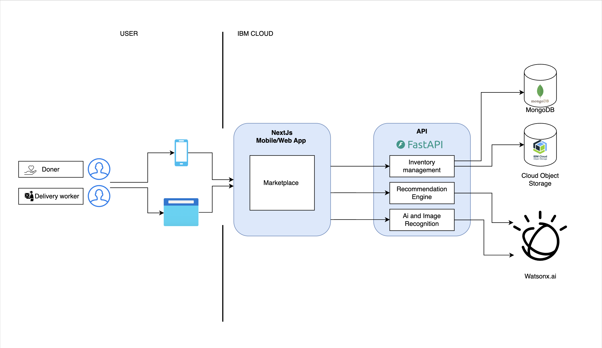
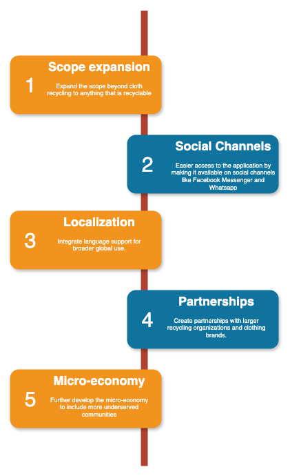

[](https://www.apache.org/licenses/LICENSE-2.0) [](https://developer.ibm.com/callforcode/solutions/projects/get-started/)


# Kind Threads

- [Project summary](#project-summary)
  - [The issue we are hoping to solve](#the-issue-we-are-hoping-to-solve)
  - [How our technology solution can help](#how-our-technology-solution-can-help)
  - [Our idea](#our-idea)
- [Technology implementation](#technology-implementation)
  - [IBM watsonx product(s) used](#ibm-ai-services-used)
  - [Other IBM technology used](#other-ibm-technology-used)
  - [Solution architecture](#solution-architecture)
- [Presentation materials](#presentation-materials)
  - [Solution demo video](#solution-demo-video)
  - [Project development roadmap](#project-development-roadmap)
- [Additional details](#additional-details)
  - [How to run the project](#how-to-run-the-project)
  - [Live demo](#live-demo)
- [About this template](#about-this-template)
  - [Contributing](#contributing)
  - [Versioning](#versioning)
  - [Authors](#authors)
  - [License](#license)
  - [Acknowledgments](#acknowledgments)

## Project summary

### The issue we are hoping to solve

Many used clothes end up in landfills, contributing to environmental pollution, carbon emissions, and water wastage. At the same time, many vulnerable groups lack access to sustainable livelihoods. Our solution aims to address both these issues by promoting recycling of used clothes and creating income opportunities for underserved communities.

### How our technology solution can help

An AI-powered app that promotes clothes recycling and empowers local communities.

### Our idea    

Kind Threads is an innovative platform designed to educate people on the environmental benefits of recycling used clothes, while also providing a seamless way for users to take action. By leveraging IBM Watsonx.AI for image recognition, our app enables users to take pictures of any clothing item and receive insights into how that item can be reused, recycled, or donated based on its condition.

The core of our solution is an AI-driven identification system that assesses the item’s wearability and provides data-driven recommendations, such as:

- How much water could be saved by recycling the item
- How much CO2 emissions could be reduced
- Nearby recycling or donation centers where the item can be dropped off

The app promotes environmental sustainability by gamifying the experience for end users. Each item they donate or recycle adds to their personal impact statistics, which display the cumulative environmental benefits they’ve contributed—such as the amount of carbon prevented or water conserved. These tangible metrics help motivate users to participate in the circular economy.

Additionally, our solution tackles social equity by creating micro-economic opportunities for low-wage workers and vulnerable groups. Through the platform, these individuals can sign up as pickup and delivery agents, earning money by collecting and delivering items to recycling centers or donation hubs. This helps bridge the gap between environmental sustainability and economic inclusion, offering these workers a sustainable income stream.

Our platform is built using cutting-edge technologies:

- **IBM Watsonx.AI** powers the image recognition and AI-based recommendations.
- **Next.js** and **React.js** provide a responsive and user-friendly interface.
- **Python FastAPI** manages backend processes efficiently, ensuring smooth operation and scalability.
- **LangChain** is used to streamline decision-making processes and optimize AI outputs.

By combining these technologies, Kind Threads is not only reducing environmental waste but also empowering underserved communities. Unlike other recycling platforms that focus solely on environmental aspects, Kind Threads integrates social impact, making it an inclusive solution for sustainable living.


## Technology implementation

### IBM watsonx product(s) used

**Featured watsonx products**

- [watsonx.ai](https://www.ibm.com/products/watsonx-ai) - We use Watsonx.AI to power the core image recognition functionality of Kind Threads. When a user uploads a picture of a clothing item, Watsonx.AI identifies the item, analyzes its condition, and provides recommendations for how it should be recycled or reused. Watsonx.AI’s AI models also calculate environmental benefits, such as the water saved or carbon emissions reduced from recycling the item.

- [watsonx Assistant](https://cloud.ibm.com/catalog/services/watsonx-assistant) - By integrating the Watson Assistant chat assistant with WhatsApp, users can initiate, manage, and complete the clothing donation process directly via chat. This can remove the need for users to open the app, making the experience more frictionless and accessible. 

### Other IBM technology used


**Additional IBM AI services (Remove any that you did not use)**

- [Watson Machine Learning](https://cloud.ibm.com/catalog/services/watson-machine-learning) - Watson Machine Learning provisioned IBM Cloud provides the foundational models and  generate AI toolset to build the image recognition functionality 

- [Watson Studio](https://cloud.ibm.com/catalog/services/watson-studio) - Watson Studio is utilized as a development platform to collaborate on and fine-tune our prompt in the PromptLab


### Solution architecture

Diagram and step-by-step description of the flow of our solution:



1. User Uploads a Picture: Users use their camera to take a photo of an item they wish to recycle or donate.
2. Item Identification: Watsonx.AI processes the image to identify the type of clothing and assess its condition.
3. Environmental Impact Calculation: Watson Machine Learning models calculate potential water savings, CO2 emissions prevented, and other environmental metrics.
4. Recommendations: The app provides recycling or donation recommendations, including nearby centers where the item can be dropped off.
5. Micro-Economy Activation: Local workers acting as delivery agents can be notified to pick up the item and deliver it to a recycling center, creating income opportunities.
6. Gamification and Impact Tracking: Users earn rewards and track their environmental impact via the app, motivating continued participation.

## Presentation materials

### Solution demo video

[](https://youtu.be/vOgCOoy_Bx0)

### Project development roadmap

The project currently does the following things:

- Item Recognition: Uses Watsonx.AI to identify clothing items and their condition.
- Environmental Metrics Calculation: Calculates water and carbon savings from recycling the item.
- Recycling and Donation Recommendations: Provides nearby centers for donation and recycling.
- Micro-Economy Creation: Facilitates income generation for low-wage workers through a delivery network.
- Gamification: Tracks user impact and encourages continued participation through rewards.

In the future we plan to...

<!-- - Expand the scope beyond cloth recycling to anything that is recyclable
- Easier access to the application by making it available on social channels like Facebook Messenger and Whatsapp
- Integrate language support for broader global use.
- Create partnerships with larger recycling organizations and clothing brands.
- Further develop the micro-economy to include more underserved communities.

See below for our proposed schedule on next steps after Call for Code 2024 submission. -->




### How to run the project

#### Start the  backend API
1. Create virtual environemt by running following commands
```
py -m venv server
source server/bin/activate
```

2. Install dependencies

```
pip install -r requirements.txt
```

3. Start the API server
```
uvicorn app.main:app --reload
```

#### Start the  frontend UI
install dependencies
```bash
yarn install
```

build the package:

```bash
yarn build
```

run the client:

```bash
yarn start
```


### Authors

- [Purva Naik](https://github.com/purva2412)
- [Sheldon Fernandes](https://github.com/sheldonfernandes)
- [Shreya Pimprikar](https://github.com/ShreyaPimprikar)
- [Sanket Phansekar](https://github.com/sanketphansekar)
- [Suresh Nikuliya](https://github.com/SureshNikuliya)
